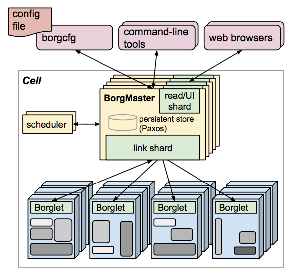
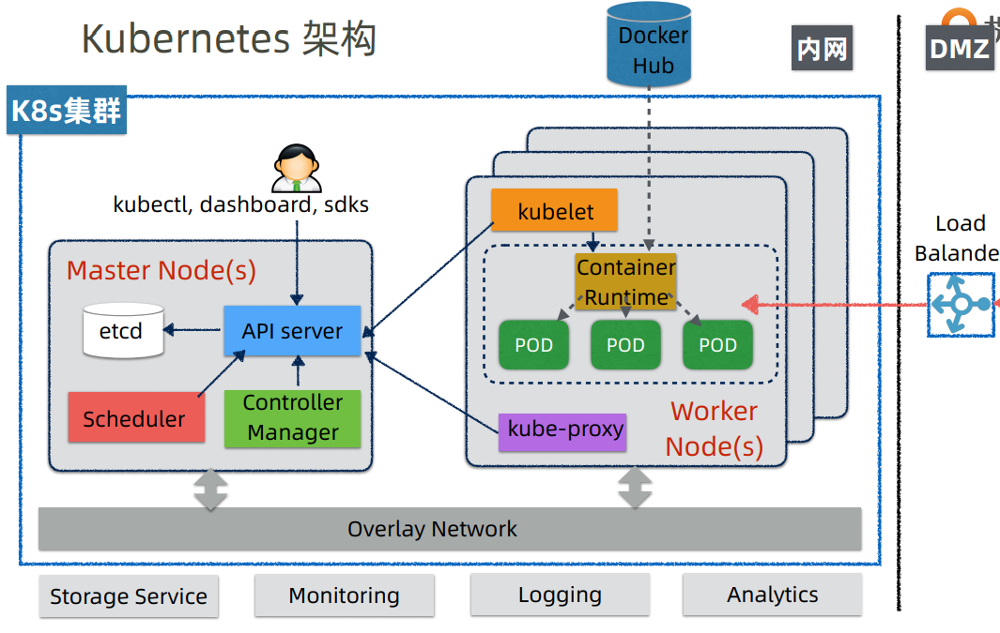

#### 什么是云原生

基于微服务原理而开发的应用，以容器方式打包。
在运行时，容器由运行于云基础设施之上的平台进行调度。
应用开发采用持续交付和 DevOps 实践

#### 架构

- Kubernetes 最初源于谷歌内部的Borg，提供了面向应用的容器集群部署和管理系统。
- Kubernetes 的目标旨在消除编排物理/虚拟计算，网络和存储基础设施的负担，并使应用程序运营商和开发人员完全将重点放在以容器为中心的原语上进行自助运营。
- Kubernetes 也提供稳定、兼容的基础（平台），用于构建定制化的workflows 和更高级的自动化任务。
- Kubernetes 具备完善的集群管理能力，包括多层次的安全防护和准入机制、多租户应用支撑能力、透明的服务注册和服务发现机制、内建负载均衡器、故障发现和自我修复能力、服务滚动升级和在线扩容、可扩展的资源自动调度机制、多粒度的资源配额管理能力。
- Kubernetes 还提供完善的管理工具，涵盖开发、部署测试、运维监控等各个环节。

#### borg

Borg是谷歌内部的大规模集群管理系统，负责对谷歌内部很多核心服务的调度和管理。Borg的目的是让用户能够不必操心资源管理的问题，让他们专注于自己的核心业务，并且做到跨多个数据中心的资源利用率最大化。

Borg主要由BorgMaster、Borglet、borgcfg和Scheduler组成，如下图所示

* BorgMaster是整个集群的大脑，负责维护整个集群的状态，并将数据持久化到Paxos存储中；
* Scheduer负责任务的调度，根据应用的特点将其调度到具体的机器上去；
* Borglet负责真正运行任务（在容器中）；
* borgcfg是Borg的命令行工具，用于跟Borg系统交互，一般通过一个配置文件来提交任务。

#### Kubernetes架构
Kubernetes借鉴了Borg的设计理念，比如Pod、Service、Labels和单Pod单IP等。Kubernetes的整体架构跟Borg非常像，如下图所示

Kubernetes主要由以下几个核心组件组成：

* etcd保存了整个集群的状态；
* apiserver 提供了资源操作的唯一入口，并提供认证、授权、访问控制、API注册和发现等机制；
* controller manager负责维护集群的状态，比如故障检测、自动扩展、滚动更新等；
* scheduler负责资源的调度，按照预定的调度策略将Pod调度到相应的机器上；
* kubelet负责维护容器的生命周期，同时也负责Volume（CVI）和网络（CNI）的管理；
* Container runtime负责镜像管理以及Pod和容器的真正运行（CRI）；
* kube-proxy负责为Service提供cluster内部的服务发现和负载均衡；
除了核心组件，还有一些推荐的Add-ons：

kube-dns负责为整个集群提供DNS服务
* Ingress Controller为服务提供外网入口
* Heapster提供资源监控
* Dashboard提供GUI
* Federation提供跨可用区的集群
* Fluentd-elasticsearch提供集群日志采集、存储与查询

#### Kubernetes 设计理念，细节

- 设计理念参考： http://docs.kubernetes.org.cn/249.html
- 设计细节参考：http://docs.kubernetes.org.cn/829.html