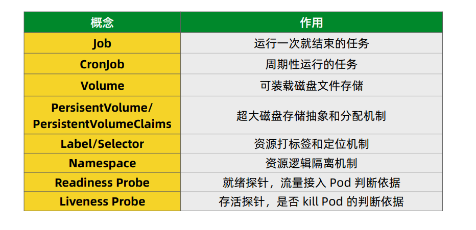

#### Master 组件

Master组件提供集群的管理控制中心。

Master组件可以在集群中任何节点上运行。但是为了简单起见，通常在一台VM/机器上启动所有Master组件，并且不会在此VM/机器上运行用户容器。
- 生产建议三个master节点
- 参考地址（构建高可用集群）https://kubernetes.io/docs/setup/production-environment/tools/kubeadm/high-availability/

#### kube-apiserver

kube-apiserver用于暴露Kubernetes API。任何的资源请求/调用操作都是通过kube-apiserver提供的接口进行。请参阅构建高可用群集。

#### ETCD

etcd是Kubernetes提供默认的存储系统，保存所有集群数据，使用时需要为etcd数据提供备份计划。

#### kube-controller-manager
kube-controller-manager运行管理控制器，它们是集群中处理常规任务的后台线程。逻辑上，每个控制器是一个单独的进程，但为了降低复杂性，它们都被编译成单个二进制文件，并在单个进程中运行。

这些控制器包括：

- 节点（Node）控制器。
- 副本（Replication）控制器：负责维护系统中每个副本中的pod。
- 端点（Endpoints）控制器：填充Endpoints对象（即连接Services＆Pods）。
Service Account和Token控制器：为新的Namespace 创建默认帐户访问API Token。

#### cloud-controller-manager
云控制器管理器负责与底层云提供商的平台交互。云控制器管理器是Kubernetes版本1.6中引入的，目前还是Alpha的功能。

云控制器管理器仅运行云提供商特定的（controller loops）控制器循环。可以通过将--cloud-provider flag设置为external启动kube-controller-manager ，来禁用控制器循环。

cloud-controller-manager 具体功能：

- 节点（Node）控制器
- 路由（Route）控制器
- Service控制器
- 卷（Volume）控制器

#### Namespaces

当团队或项目中具有许多用户时，可以考虑使用Namespace来区分，a如果是少量用户集群，可以不需要考虑使用Namespace，如果需要它们提供特殊性质时，可以开始使用Namespace。

Namespace为名称提供了一个范围。资源的Names在Namespace中具有唯一性。

Namespace是一种将集群资源划分为多个用途(通过 resource quota)的方法。

在未来的Kubernetes版本中，默认情况下，相同Namespace中的对象将具有相同的访问控制策略。

对于稍微不同的资源没必要使用多个Namespace来划分，例如同意软件的不同版本，可以使用labels(标签)来区分同一Namespace中的资源。

#### Deployment

 为了实现在Kubernetes集群上部署容器化应用程序。需要创建一个Kubernetes  Deployment，Deployment负责创建和更新应用。创建Deployment后，Kubernetes master 会将Deployment创建好的应用实例调度到集群中的各个节点。
 
 应用实例创建完成后，Kubernetes Deployment Controller会持续监视这些实例。如果管理实例的节点被关闭或删除，那么 Deployment Controller将会替换它们，实现自我修复能力。
 
 “在旧的世界中” ，一般通常安装脚本来启动应用，但是便不会在机器故障后自动恢复。通过在Node节点上运行创建好的应用实例，使 Kubernetes Deployment 对应用管理提供了截然不同的方法。
    
        部署表示用户对K8s集群的一次更新操作。部署是一个比RS应用模式更广的API对象，可以是创建一个新的服务，更新一个新的服务，也可以是滚动升级一个服务。
        滚动升级一个服务，实际是创建一个新的RS，然后逐渐将新RS中副本数增加到理想状态，将旧RS中的副本数减小到0的复合操作；这样一个复合操作用一个RS是不太好描述的，所以用一个更通用的Deployment来描述。
        以K8s的发展方向，未来对所有长期伺服型的的业务的管理，都会通过Deployment来管理。

#### Replica Sets 副本集

- ReplicaSet（RS）是Replication Controller（RC）的升级版本。ReplicaSet 和  Replication Controller之间的唯一区别是对选择器的支持。
- ReplicaSet支持labels user guide中描述的set-based选择器要求， 而Replication Controller仅支持equality-based的选择器要求。

- ReplicaSet能确保运行指定数量的pod。然而，Deployment 是一个更高层次的概念，它能管理ReplicaSets，并提供对pod的更新等功能。
 因此，我们建议你使用Deployment来管理ReplicaSets，除非你需要自定义更新编排。
 
        RS是新一代RC，提供同样的高可用能力，区别主要在于RS后来居上，能支持更多种类的匹配模式。副本集对象一般不单独使用，而是作为Deployment的理想状态参数使用。
#### pod

Pod是Kubernetes中一个抽象化概念，由一个或多个容器组合在一起得共享资源。这些资源包括：

- 共享存储，如 Volumes 卷
- 网络，唯一的集群IP地址
- 每个容器运行的信息，例如:容器镜像版本
- Pod模型是特定应用程序的“逻辑主机”，并且包含紧密耦合的不同应用容器。

Pod中的容器共享IP地址和端口。

* Pod是Kubernetes中的最小单位，当在Kubernetes上创建Deployment时，该Deployment将会创建具有容器的Pods（而不会直接创建容器），每个Pod将被绑定调度到Node节点上，并一直保持在那里直到被终止（根据配置策略）或删除。
在节点出现故障的情况下，群集中的其他可用节点上将会调度之前相同的Pod。

        K8s有很多技术概念，同时对应很多API对象，最重要的也是最基础的是微服务Pod。
        Pod是在K8s集群中运行部署应用或服务的最小单元，它是可以支持多容器的。
        Pod的设计理念是支持多个容器在一个Pod中共享网络地址和文件系统，可以通过进程间通信和文件共享这种简单高效的方式组合完成服务。
        Pod对多容器的支持是K8s最基础的设计理念。比如你运行一个操作系统发行版的软件仓库，一个Nginx容器用来发布软件，另一个容器专门用来从源仓库做同步，这两个容器的镜像不太可能是一个团队开发的，但是他们一块儿工作才能提供一个微服务；这种情况下，不同的团队各自开发构建自己的容器镜像，在部署的时候组合成一个微服务对外提供服务。
        Pod是K8s集群中所有业务类型的基础，可以看作运行在K8s集群中的小机器人，不同类型的业务就需要不同类型的小机器人去执行。目前K8s中的业务主要可以分为长期伺服型（long-running）、批处理型（batch）、节点后台支撑型（node-daemon）和有状态应用型（stateful application）；分别对应的小机器人控制器为Deployment、Job、DaemonSet和PetSet，本文后面会一一介绍。

#### node 

一个Pod总是在一个（Node）节点上运行，Node是Kubernetes中的工作节点，可以是虚拟机或物理机。
每个Node由 Master管理，Node上可以有多个pod，Kubernetes Master会自动处理群集中Node的pod调度，同时Master的自动调度会考虑每个Node上的可用资源。

每个Kubernetes Node上至少运行着：

Kubelet，管理Kubernetes Master和Node之间的通信; 管理机器上运行的Pods和containers容器。
container runtime（如Docker，rkt）。

#### service

* Kubernetes中的Service 是一个抽象的概念，它定义了Pod的逻辑分组和一种可以访问它们的策略，这组Pod能被Service访问，使用YAML （优先）或JSON 来定义Service，Service所针对的一组Pod通常由LabelSelector实现（参见下文，为什么可能需要没有 selector 的 Service）。

可以通过type在ServiceSpec中指定一个需要的类型的 Service，Service的四种type:

- ClusterIP（默认） - 在集群中内部IP上暴露服务。此类型使Service只能从群集中访问。
- NodePort - 通过每个 Node 上的 IP 和静态端口（NodePort）暴露服务。NodePort 服务会路由到 ClusterIP 服务，这个 ClusterIP 服务会自动创建。通过请求 <NodeIP>:<NodePort>，可以从集群的外部访问一个 NodePort 服务。
- LoadBalancer - 使用云提供商的负载均衡器（如果支持），可以向外部暴露服务。外部的负载均衡器可以路由到 NodePort 服务和 ClusterIP 服务。
- ExternalName - 通过返回 CNAME 和它的值，可以将服务映射到 externalName 字段的内容，没有任何类型代理被创建。这种类型需要v1.7版本或更高版本kube-dnsc才支持。

* Kubernetes Service 是一个抽象层，它定义了一组逻辑的Pods，借助Service，应用可以方便的实现服务发现与负载均衡。

        RC、RS和Deployment只是保证了支撑服务的微服务Pod的数量，但是没有解决如何访问这些服务的问题。
        一个Pod只是一个运行服务的实例，随时可能在一个节点上停止，在另一个节点以一个新的IP启动一个新的Pod，因此不能以确定的IP和端口号提供服务。
        要稳定地提供服务需要服务发现和负载均衡能力。
        服务发现完成的工作，是针对客户端访问的服务，找到对应的的后端服务实例。
        在K8s集群中，客户端需要访问的服务就是Service对象。
        每个Service会对应一个集群内部有效的虚拟IP，集群内部通过虚拟IP访问一个服务。
        在K8s集群中微服务的负载均衡是由Kube-proxy实现的。
        Kube-proxy是K8s集群内部的负载均衡器。
        它是一个分布式代理服务器，在K8s的每个节点上都有一个；这一设计体现了它的伸缩性优势，需要访问服务的节点越多，提供负载均衡能力的Kube-proxy就越多，高可用节点也随之增多。
        与之相比，我们平时在服务器端做个反向代理做负载均衡，还要进一步解决反向代理的负载均衡和高可用问题。

#### 任务（Job）

Job是K8s用来控制批处理型任务的API对象。
批处理业务与长期伺服业务的主要区别是批处理业务的运行有头有尾，而长期伺服业务在用户不停止的情况下永远运行。
Job管理的Pod根据用户的设置把任务成功完成就自动退出了。
成功完成的标志根据不同的spec.completions策略而不同：
单Pod型任务有一个Pod成功就标志完成；定数成功型任务保证有N个任务全部成功；工作队列型任务根据应用确认的全局成功而标志成功。

#### 后台支撑服务集（DaemonSet）
长期伺服型和批处理型服务的核心在业务应用，可能有些节点运行多个同类业务的Pod，有些节点上又没有这类Pod运行；
而后台支撑型服务的核心关注点在K8s集群中的节点（物理机或虚拟机），要保证每个节点上都有一个此类Pod运行。
节点可能是所有集群节点也可能是通过nodeSelector选定的一些特定节点。典型的后台支撑型服务包括，存储，日志和监控等在每个节点上支持K8s集群运行的服务。

#### Labels

Service 使用label selectors来匹配一组Pod，允许对Kubernetes中的对象进行逻辑运算，Label以key/value 键/值对附加到对象上。以多种方式使用：

- 指定用于开发，测试和生产的对象
- 嵌入版本Label
- 使用Label分类对象。

### 图片补充

